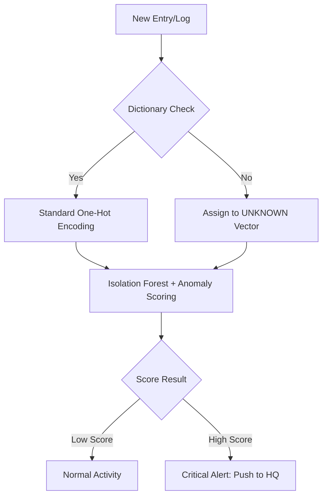

# AI / ML Design (Edge & HQ)

CloudGuard AI uses a **two-level AI architecture**. The edge model performs fast, lightweight anomaly detection, while the HQ model performs deeper analysis using richer context and aggregated data. This division reflects the difference between immediate endpoint decisions and centralized behavioral analysis.

## Edge Agent ML

The **Edge Agent** is designed for fast local detection and immediate response with minimal overhead.

### Model

* **Isolation Forest**

### Purpose

* Detect obvious or high-signal anomalies quickly
* Support instant blocking or early warning at the device/site level
* Minimize performance impact on endpoints

### Feature Engineering

* **Cyclical encoding** for time features
* **One-hot encoding** for categorical features such as process, action, or user-style attributes
* **External/internal IP logic** to identify perimeter-related anomalies

This model is appropriate for detecting loud attacks such as unusual access patterns, suspicious process activity, or clear deviations from normal local behavior.

## HQ ML

The **HQ layer** performs more computationally expensive and context-rich analysis.

### Models

* **Deep LSTM Autoencoder** for sequential anomaly detection
* **DistilBERT / semantic embedding layer** for text, email, or message understanding

### Purpose

* Detect low-and-slow attacks
* Detect insider threats
* Analyze multi-event or sequence-based behavior
* Use richer centralized context across devices, users, and cases

Compared with the edge model, HQ analysis can incorporate longer time windows, aggregated organizational behavior, and semantic context from textual security artifacts. This makes it more suitable for subtle attacks that are difficult to detect from a single local event.

## Risk Scoring and Enrichment

Model outputs can be converted into operational risk scores by combining:

* **Model confidence**
* **Asset criticality**

A practical interpretation is:

* High anomaly score on a low-value asset → lower response urgency
* High anomaly score on a critical server or executive device → higher response urgency

The design also supports **behavioral mapping to MITRE ATT\&CK** and future enrichment through **threat intelligence APIs**. This allows anomaly detection results to be translated into security-relevant categories and, when needed, enriched with external context.

## Handling Unseen Events

A primary challenge for edge-based security is handling logs or events that were not seen during the initial two-week baselining phase. CloudGuard AI utilizes a specialized "Unknown Vector" logic to ensure these events are not ignored.

#### Detection Process

When a new entry or log is generated on an agent device, it follows a specific logic path:

1. **Dictionary Check:** The system checks the incoming log against a pre-defined dictionary of known event types.
2. **Encoding Path:**
   * **Known Events:** If the entry exists in the list, the system applies **Standard One-Hot Encoding** to prepare the data for the model.
   * **New/Unknown Events:** If the entry is missing from the dictionary, the system assigns it to a dedicated **\[UNKNOWN] Vector** (e.g., `[0,0,0,1]`).
3. **Anomaly Scoring:** Both recognized and unknown vectors are processed by the **Isolation Forest**.
4. **Critical Escalation:** While known events are typically assigned a **Low Score**, unknown vectors naturally result in a **High Score**. This triggers a **Critical Alert** that is immediately pushed to HQ for expert analysis.

#### Logical Flow

