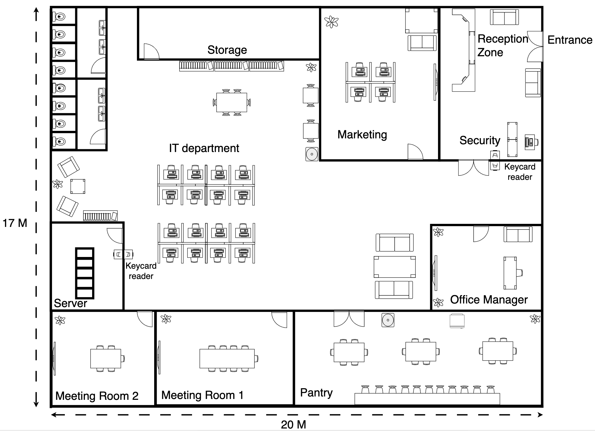

# Floor Plan

The physical infrastructure of CloudGuard AI is distributed across multiple company locations to support our hybrid operational model. This setup includes our primary Headquarters (HQ) and a dedicated Branch Office.

### 1. Branch Office

This 20m x 17m facility serves as a key operational node for our distributed teams.

<figure><figcaption></figcaption></figure>

#### Key Features:

* **Secured Server Room:** Critical local infrastructure is housed in a dedicated room protected by a **keycard reader**. This facility hosts the local **Master Agent** used for regional data collection and initial processing.
* **Operational Departments:** The floor plan includes dedicated zones for the **IT department** and **Marketing**, ensuring that regional support and outreach teams have a structured workspace.
* **Physical Security:** Access is strictly controlled through a **Reception Zone** and a monitored **Entrance**, with an additional **Security** post located near the main thoroughfare.

***

### 2. HQ 1st Floor (Operations & Administration)

Our 35m x 20m HQ first floor handles the business's administrative and physical security functions.

<figure><figcaption></figcaption></figure>

#### Key Features:

* **Security Control & CCTV Monitoring:** A dedicated high-security zone for physical site monitoring.
* **Departmental Separation:** Core business functions such as Finance, HR, and Marketing are zoned to prevent unauthorized access to operational areas.
* **Guest Management:** A dedicated Guest Meeting room near the Reception ensures that visitors do not need to enter the facility deeply.

***

### 3. HQ 2nd Floor (The Operational Heart)

The second floor is the most critical zone, housing our core compute resources and the primary Security Operations Center (SOC).

<figure><figcaption></figcaption></figure>

#### Key Features:

* **Centralized Server Room:** Located in the exact center of the floor for optimal cooling and physical protection. This high-security zone houses our **NVIDIA DGX clusters** and core storage arrays.
* **SoC Team Command Center:** A specialized workspace for our Tier 1 and Tier 2 analysts to perform real-time monitoring and incident response.
* **Executive Oversight (The "C-Suite"):** The offices for the **CISO, CTO, and CEO** are located on this floor, ensuring that leadership is immediately available for high-level decision-making during major security incidents.
* **Physical Redundancy:** The layout includes multiple meeting rooms and IT support zones to ensure 24/7 operational continuity.
