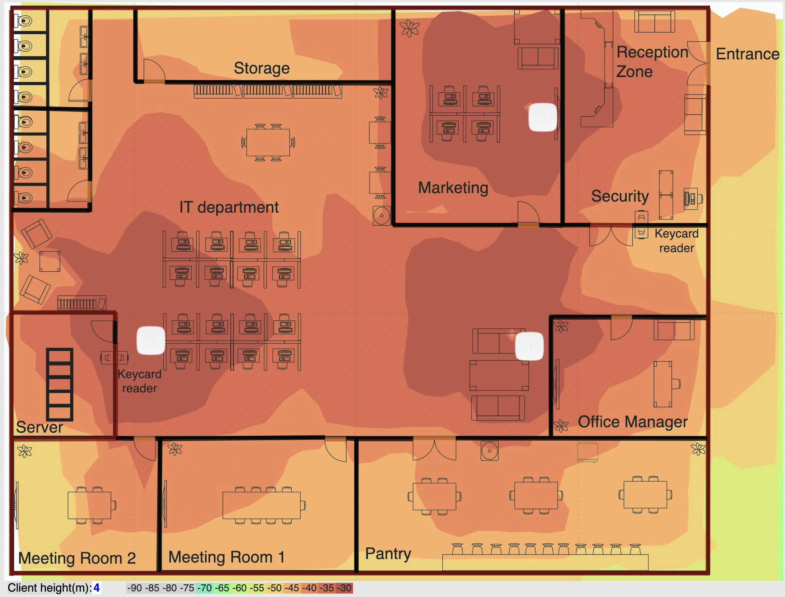
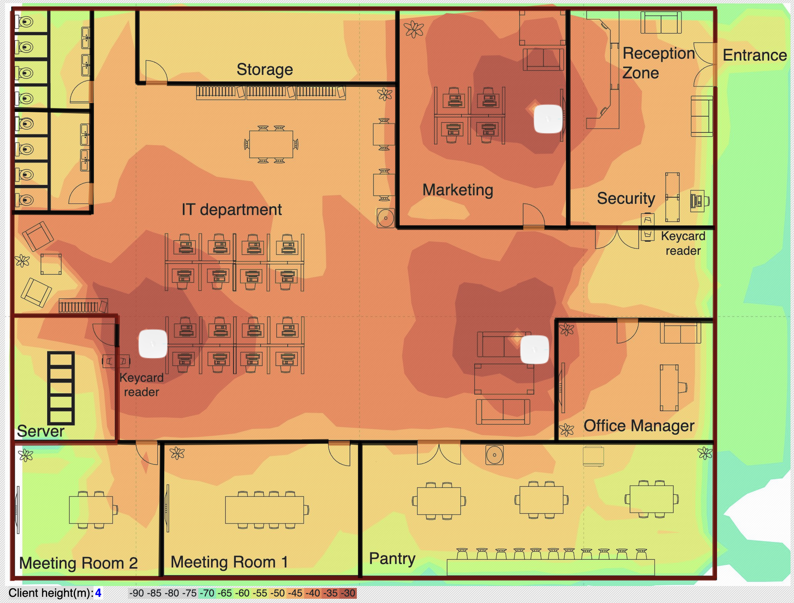
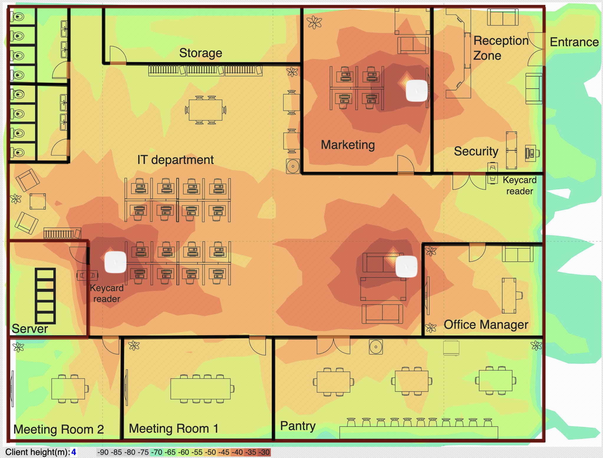

# Branch Office Heatmaps

### 2.4 GHz Coverage

<figure><figcaption></figcaption></figure>

### 5 GHz Coverage

<figure><figcaption></figcaption></figure>

### 6 GHz Coverage

<figure><figcaption></figcaption></figure>

