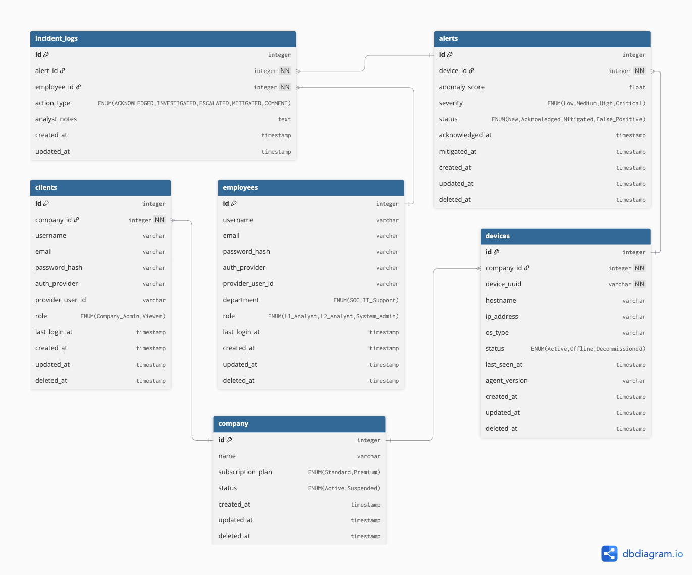

# Database Design

CloudGuard AI utilizes a relational database schema designed for multi-tenancy, granular access control, and comprehensive audit logging. The schema ensures that security data from different companies remains isolated while providing a unified interface for SOC analysts.

### Entity Relationship Diagram (ERD)

<figure><figcaption></figcaption></figure>

### Core Table Structures

#### 1. Multi-Tenancy & Identity

* **company**: The root of the hierarchy. It manages subscription tiers (Standard, Premium) and overall account status.
* **clients**: Individual users belonging to the SME. They have roles like `Company_Admin` or `Viewer` to access the local dashboard.
* **employees**: Members of the MSSP (SOC) team. They are categorized by `department` (SOC, IT Support) and `role` (L1/L2 Analyst, System Admin).

#### 2. Asset & Threat Management

* **devices**: Represent endpoints monitored by the Edge Agent. It tracks metadata such as `hostname`, `ip_address`, `os_type`, and `agent_version`.
* **alerts**: Security events generated by the AI models. Each alert is linked to a specific device and carries an `anomaly_score` and `severity` level (Low to Critical).

#### 3. Incident Lifecycle & Audit Trail

* **incident\_logs**: A critical table for accountability. It records every action taken on an alert, including acknowledgments, mitigations, and analyst notes. This data serves as the primary feedback loop for the MLOps pipeline.

### Design Highlights

* **Data Isolation**: All client-facing data is linked via `company_id` to prevent cross-tenant data leakage.
* **Auditability**: Every change to an alert status is timestamped and attributed to a specific `employee_id`.
* **Standardized Statuses**: Using ENUMs for severity and status ensures data consistency, which is vital for both the AI model's training and operational reporting.
