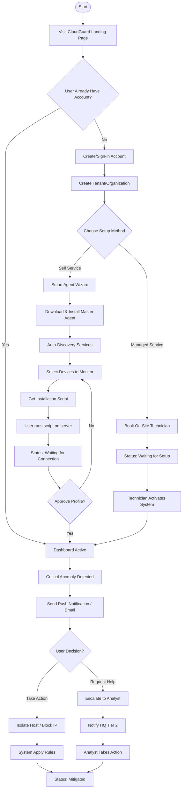

# Client Onboarding & Response Flow

This flow tracks the journey of an SME client from their initial visit to the platform through to active threat mitigation.

#### Onboarding & Setup

* **Entry Point**: Users begin on the CloudGuard landing page, where they can create a new organization/tenant or sign in to an existing account.
* **Hybrid Setup Choice**: To accommodate different technical capabilities, we offer two paths:
  * **Managed Service**: For clients requiring "white-glove" support, a technician is booked to perform on-site activation and system validation.
  * **Self-Service**: IT-capable teams use the **Smart Agent Wizard** to download a master agent. The system then utilizes **Auto-Discovery** to identify network devices, allowing the user to select specific targets and run automated installation scripts.
* **Validation**: Once the agent connects, the system generates a profile for approval before the dashboard becomes fully active.

#### Monitoring & Mitigation

* **Real-Time Detection**: When a critical anomaly is identified, the system immediately issues push notifications and emails to the client.
* **Decision Path**:
  * **Direct Action: The client can choose to immediately isolate the Host or block the IP through the dashboard.**
  * **Expert Escalation**: Alternatively, the client can request help, which escalates the incident directly to the Tier 2 HQ analysts for professional intervention.

