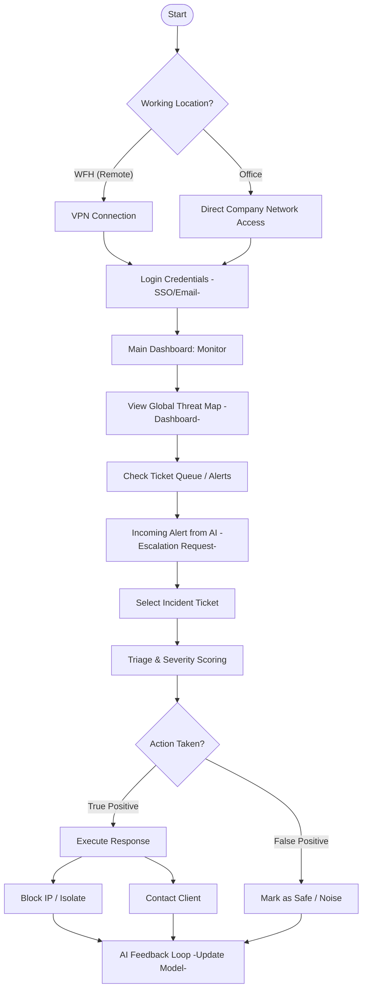

# SOC Analyst Flow

This flow describes the daily operations of our security experts as they monitor global threats and manage incoming escalations.

#### Secure Access & Monitoring

* **Connectivity**: Analysts access the environment based on their location. Remote (WFH) staff must establish a **Secure VPN Connection**, while on-site staff uses direct company network access.
* **Authentication**: Security is enforced through **Single Sign-On (SSO)** and Multi-Factor Authentication (MFA) to ensure that only authorized personnel can access the core systems.
* **Situational Awareness**: Upon login, analysts monitor the **Global Threat Map** and manage the **Incident Ticket Queue**, which tracks active alerts across all client organizations.

#### Incident Triage & AI Feedback Loop

* **AI Escalation**: High-confidence threats are pushed to the analyst via an AI-generated escalation request.
* **Investigation & Scoring**: Analysts select an incident and perform triage, assigning a **Severity Score** based on asset criticality and model confidence.
* **Resolution Path**:
  * **True Positive**: The analyst implements a response, such as blocking malicious IPs or isolating infected endpoints, and then communicates directly with the client.
  * **False Positive**: If the activity is determined to be legitimate noise, it is marked as safe.
* **Continuous Learning (MLOps)**: Regardless of the outcome, the final decision is fed back into the **AI Feedback Loop**. This data is used to retrain the Isolation Forest and LSTM models, thereby improving the system's accuracy over time.

